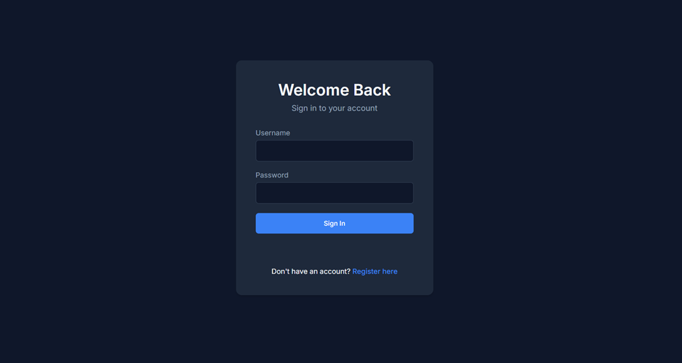
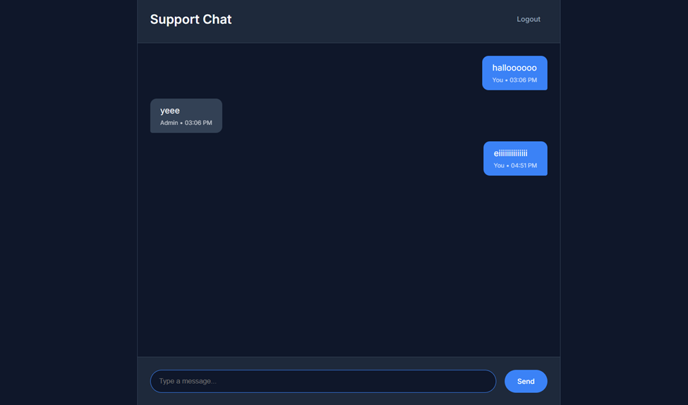
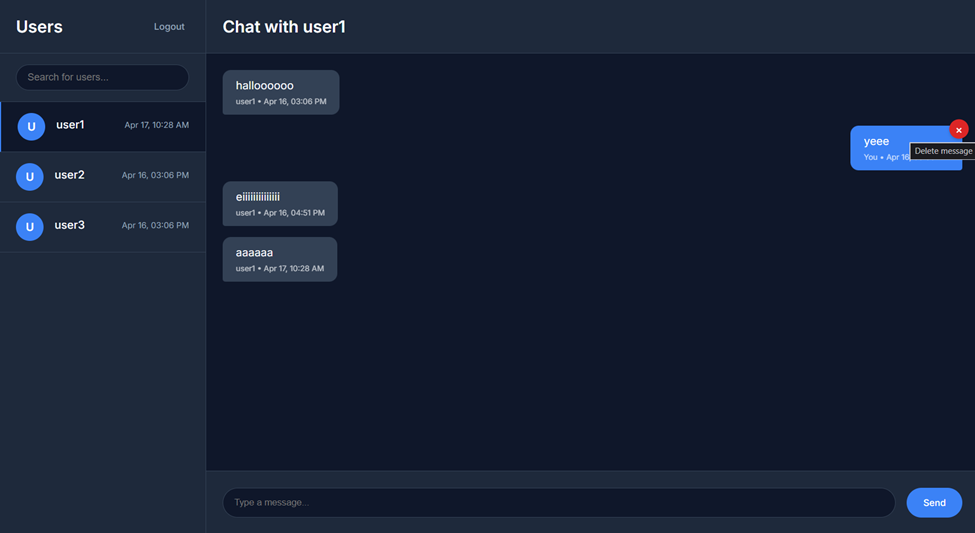
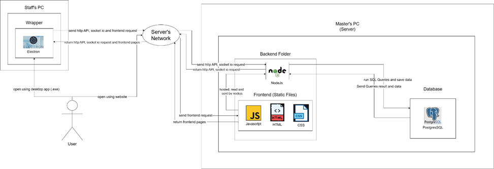
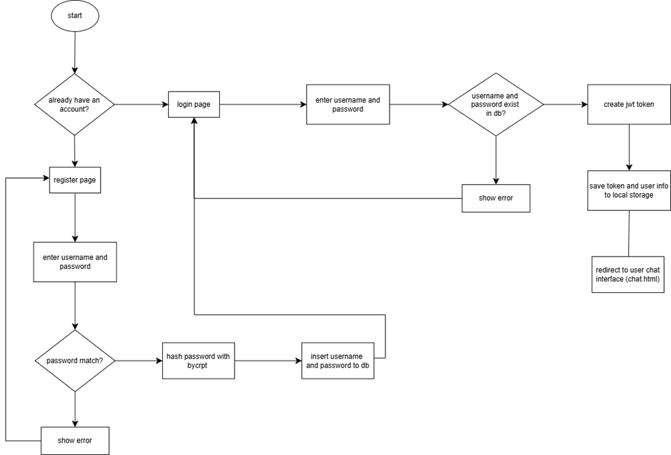
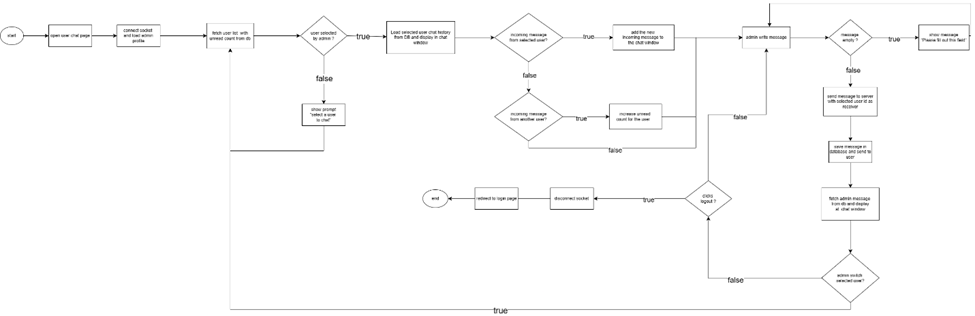
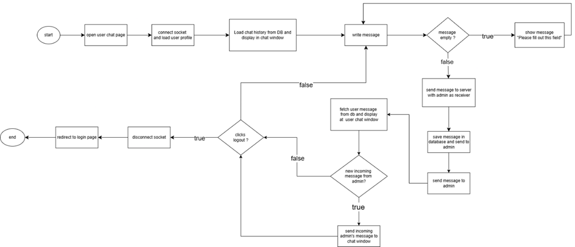
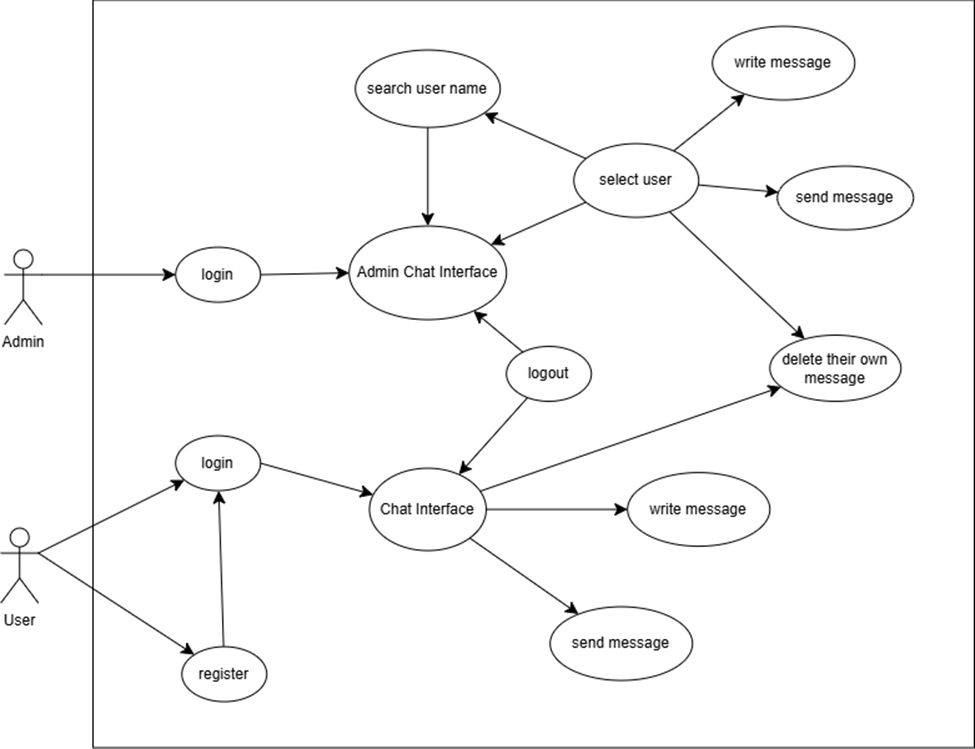
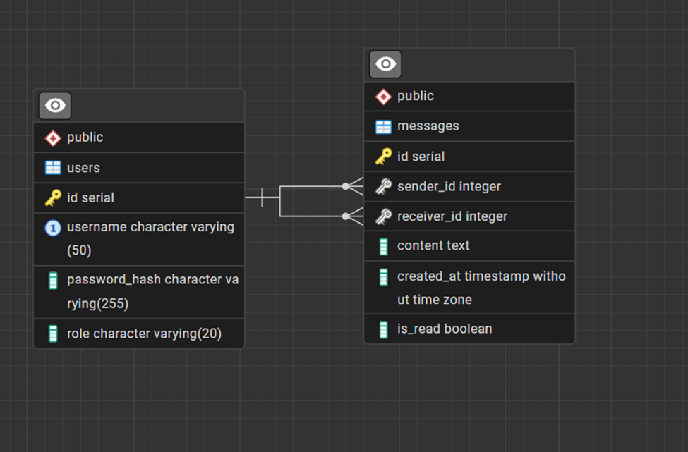

# AdminReach

AdminReach is an internal real-time support chat platform with a Node.js + Express + PostgreSQL backend and an Electron desktop client for staff.

It includes:
- JWT-based authentication (admin and user roles)
- Real-time messaging using Socket.io
- Message history and read status
- Admin inbox and reply workflow
- Desktop client packaging with Electron


## Project Structure

```text
Backend/      -> API server, Socket.io, auth/chat routes, frontend static files
Electron/     -> Desktop client shell and packaging config
database/     -> PostgreSQL schema + seed data (setup.sql)
*.txt         -> Deployment, maintenance, and dependency notes
```

## Tech Stack

Backend:
- Node.js
- Express
- Socket.io
- PostgreSQL (`pg`)
- JWT (`jsonwebtoken`)
- `bcryptjs`
- `dotenv`
- `cors`

Desktop:
- Electron
- electron-builder

Frontend:
- Vanilla HTML/CSS/JavaScript
- Socket.io client via CDN

## Key Features

- Role-based access (`admin`, `user`)
- Secure login and registration with hashed passwords
- Protected API routes with JWT middleware
- Real-time user-to-admin support messages
- Admin replies delivered instantly to online users
- Conversation history from PostgreSQL
- Read-status update for admin workflows
- Sender-only message deletion

## Architecture Overview

Runtime flow:
1. User or admin logs in via `/api/auth/login`.
2. Backend issues JWT token (24h expiry).
3. Frontend/Electron stores token and sends it in API calls.
4. Socket connects with token in handshake auth.
5. Messages are persisted in PostgreSQL, then broadcast in real-time.

High-level components:
- Express REST API for auth and chat operations
- Socket.io layer for instant message delivery
- PostgreSQL for users and messages
- Electron shell for desktop distribution

## API Summary

Auth:
- `POST /api/auth/register`
- `POST /api/auth/login`

Chat:
- `GET /api/chat/users` (admin only)
- `POST /api/chat/read/:userId` (admin only)
- `GET /api/chat/messages/:userId` (authenticated)
- `DELETE /api/chat/message/:messageId` (sender only)

## Quick Start (Development)

### 1. Database Setup

1. Install PostgreSQL.
2. Create a database (example: `adminreach`).
3. Run SQL from `database/setup.sql`.

### 2. Backend Setup

```bash
cd Backend
npm install
```

Create `Backend/.env` from `Backend/.env.example`:

```bash
copy .env.example .env
```

Then set your real values in `Backend/.env`:

```env
PORT=5000
DB_USER=postgres
DB_PASSWORD=your_password
DB_HOST=localhost
DB_PORT=5432
DB_NAME=adminreach
JWT_SECRET=replace_with_a_strong_secret
IP_ADDRESS=127.0.0.1
```

Run backend:

```bash
npm start
```

### 3. Electron Client Setup

```bash
cd Electron
npm install
```

Create `Electron/.env` from `Electron/.env.example`:

```bash
copy .env.example .env
```

Then set your real values in `Electron/.env`:

```env
SERVER_URL=http://127.0.0.1:5000
```

Run desktop app:

```bash
npm start
```

## Production / Office Deployment

For complete server and PM2 deployment steps, see:
- `Deployment_Guide.txt`
- `Maintenance_Guide.txt`

## Build Artifacts

Backend executable:

```bash
cd Backend
npm run build
```

Electron portable client:

```bash
cd Electron
npm run build
```

## Documentation Index

- `Backend/README.md` -> Backend architecture, env vars, and endpoints
- `Electron/README.md` -> Desktop app behavior and packaging
- `docs/README.media.md` -> How to add UI screenshots and diagrams on GitHub

## UI Screenshots

> Replace filenames below with your actual image names after upload.

### Login Screen


### User Chat Screen


### Admin Dashboard


## System Architecture Diagram



## Authentication Admin Flowchart 


## Authentication User Flowchart



## Admin Chat Flow Flowchart



## User Chat Flow Flowchart



## Use-Case Diagram



## ERD Diagram




